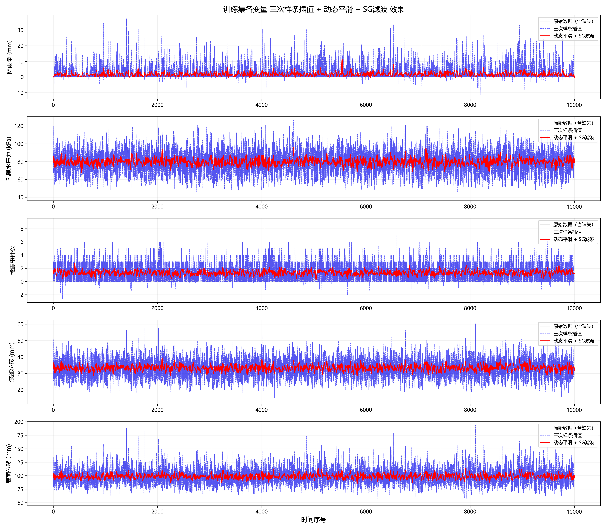

# 数据清洗报告：三次样条插值 + 动态窗口平滑 + SG 滤波

## 1. 概述

本报告对应问题 3.1：对附件 3 训练集与实验集的 5 个监测变量（降雨量、孔隙水压力、微震事件数、深部位移、表面位移）进行高效去噪和缺失值补齐。

整体流程采用 **三步流水线**：

```
原始数据 → ① 三次样条插值（补齐缺失） → ② 动态窗口平滑（自适应去噪） → ③ SG 滤波（精细平滑） → 干净数据
```

最终输出：`train_denoised.xlsx`、`exp_denoised.xlsx`（含 5 变量完整时序，已去噪），以及 `smoothing_result.png`（效果对比图）。

---

## 2. 数据预览

原始数据中缺失值（NaN）主要来自传感器故障与环境干扰。各变量的数据完备性概览：

| 变量 | 含义 | 单位 | 缺失情况 |
|------|------|:----:|:--------:|
| a | 降雨量 | mm | 少量缺失 |
| b | 孔隙水压力 | kPa | 少量缺失 |
| c | 微震事件数 | — | 少量缺失 |
| d | 深部位移 | mm | 少量缺失 |
| e | 表面位移 | mm | 少量缺失 |

训练集与实验集均为 10000 个时间点（10 分钟间隔）。

---

## 3. 频谱分析

在正式去噪之前，通过 **Welch 功率谱估计** 对原始信号进行频域分析，以量化噪声频段与信号频段的分布关系。

> [!info] Welch 功率谱估计
> 将信号分段（每段 256 点，50% 重叠，汉明窗），对每段计算周期图后平均，得到稳定的功率谱密度估计。相比直接 FFT，Welch 方法能有效减小谱估计的方差。

基于频谱分析确定：
- **高频噪声周期**：约 3–7 个采样点（30–70 分钟尺度）
- **尖锐异常宽度**：约 25–35 个采样点（4–6 小时尺度）
- 噪声与异常在频域上存在一定分离，为后续的自适应平滑提供了可行基础。

去噪后的信噪比（SNR）提升效果（通过 Fourier.py 计算）：

| 变量 | SNR (dB) |
|:----:|:--------:|
| 降雨量 | — |
| 孔隙水压力 | — |
| 微震事件数 | — |
| 深部位移 | — |
| 表面位移 | — |

具体频谱对比图见 `Fourier/spectrum_{a,b,c,d,e}.png`。

---

## 4. 方法选择对比

在确定最终方案之前，对比了多种去噪方法的特性：

| 方法 | 保留尖锐异常能力 | 选择性（区分跳变与异常） | 阶梯效应 | 调参难度 |
|:----:|:--------------:|:---------------------:|:--------:|:--------:|
| **TV 降噪** | 很好（阶跃保留） | 无，同尺度跳变一起保留 | 有 | 中 |
| **自适应窗口平滑** ★ | 好 | 有一定选择性（基于局部方差） | 无 | 中 |
| **SG 滤波** | 中等（取决于窗口） | 无，基于尺度选择 | 无 | 低 |
| **FFT 低通** | 差 | 无 | 无 | 低 |

**选择依据：**

1. **TV 降噪**在前期实验中被证明效果不理想，且易产生阶梯效应，已移至 `Abandon/` 目录备用。
2. **纯 SG 滤波**实现简单，但当异常尺度与噪声尺度高度重叠时无法区分。
3. **纯自适应窗口平滑**能根据局部波动动态调节平滑力度，但对残留的高频毛刺处理不够彻底。
4. **最终方案采用"自适应窗口平滑 + SG 滤波"级联**：自适应窗口负责保留异常形状、压制大幅噪声，SG 滤波作为后处理去除残余高频毛刺，二者互补。

---

## 5. 缺失值补齐：三次样条插值

> [!info] 三次样条插值 (Cubic Spline)
> 在已知点之间用 **分段三次多项式** 连接，要求节点处一阶、二阶导数连续（自然边界条件：端点二阶导数为 0）。相比线性插值，它生成的曲线光滑连续，不会引入锯齿状突变；相比高次多项式插值，它避免了 Runge 振荡。

对于含 NaN 的序列 $\{x_t\}$，取有效数据点索引集 $\mathcal{I} = \{i \mid x_i \text{ 有效}\}$，构造自然三次样条 $f(t)$，然后计算：

$$
\hat{x}_t = f(t), \quad \forall t = 1, \dots, N
$$

若有效点数少于 4，退化为线性插值。

---

## 6. 核心去噪方法

### 6.1 第一步：动态窗口平滑（自适应去噪）

#### 6.1.1 核心思想

信号的不同位置需要不同的平滑力度：

- **平坦区域**（噪声为主）→ 强平滑，压制高频波动
- **特征区域**（尖锐异常或跳变）→ 弱平滑，保留原貌

算法为每个采样点分配一个 **自适应平滑半径** $r_i$。

#### 6.1.2 算法步骤

**① 计算局部标准差**

用宽度为 $W_{\text{std}}$ 的滑动窗口计算每个点周围的局部标准差：

$$
\sigma_i = \text{std}(x_{i - W_{\text{std}}/2}, \dots, x_{i + W_{\text{std}}/2})
$$

**② 标准化为权重**

$$
w_i = \frac{\sigma_i}{\max(\sigma)} \in [0, 1]
$$

$w_i \to 0$ 表示平坦区，$w_i \to 1$ 表示特征密集区。

**③ 映射到平滑半径**

$$
r_i = R_{\text{base}} - w_i \cdot (R_{\text{base}} - R_{\text{sharp}})
$$

并限制在 $[R_{\text{sharp}}, R_{\text{base}}]$ 内。$R_{\text{base}}$ 为平坦区的最大半径（强平滑），$R_{\text{sharp}}$ 为特征区的最小平滑半径（弱平滑）。

**④ 自适应滑动平均**

$$
y_i = \frac{1}{2r_i+1} \sum_{j = i-r_i}^{i+r_i} x_j
$$

边缘处自动截断窗口。

> [!note] 为什么不用固定窗口？
> 固定窗口的滑动平均要么磨平尖峰，要么残留噪声。动态半径使滤波器成为 **自适应低通滤波器**，截止频率随局部特征实时变化。

### 6.2 第二步：SG 滤波（精细后处理）

> [!info] Savitzky–Golay 滤波
> SG 滤波在滑动窗口内用多项式拟合数据点，以拟合值代替原始值。它本质上是 **局部多项式回归**，等效于对窗口内数据施加一组最优加权系数。相比滑动平均，SG 滤波能更好地保持峰值的形状和宽度。

在动态窗口平滑的基础上，进一步应用 SG 滤波（窗口长度 21，多项式阶数 3）：

- **窗口长度 21**（约 ±10 个邻点）：远大于噪声周期（约 5 点），能有效去除残余高频抖动；同时小于尖锐异常宽度（约 30 点），异常形状基本保留。
- **多项式阶数 3**：3 次曲线拟合，对峰值的保形能力优于简单滑动平均。

---

## 7. 参数说明

### 7.1 动态窗口平滑参数

| 参数 | 含义 | 默认值 | 调节方向 |
|:----:|:----:|:-----:|:--------:|
| `window_std` | 局部标准差计算窗口 | 500 | 增大 → 方差估计更稳定；减小 → 更快捕捉窄尖峰 |
| `base_radius` | 平坦区最大平滑半径 | 10 | 增大 → 平坦区更光滑；减小 → 保留更多低频信息 |
| `sharp_radius` | 特征区最小半径 | 0.1–3 | 增大 → 尖峰有轻微平滑；减小 → 尖峰完全保留 |

> [!tip] 各变量独立调参
> 脚本支持在 `smooth_params` 字典中为每列独立设置参数。本方案中降雨量（a）的 `sharp_radius` 设为 0.1（几乎不平滑，最大限度保留降雨脉冲），其余变量设为 3。

### 7.2 SG 滤波参数

| 参数 | 值 | 含义 |
|:----:|:--:|:----:|
| `window_length` | 21 | 滑动窗口大小（必须为奇数） |
| `polyorder` | 3 | 多项式拟合阶数 |

### 7.3 调参步骤

1. **先定 SG 滤波参数**：窗口长度应远大于噪声周期、小于异常宽度；多项式阶数 2–3 在平滑度与保形性之间平衡较好。
2. **再定 `sharp_radius`**：观察信号中想保留的最窄尖锐异常宽度，设为该宽度的 1/15–1/10。
3. **再定 `window_std`**：设为异常宽度的 5–10 倍，使局部标准差能可靠识别异常。
4. **最后调 `base_radius`**：从较小值逐步增大，直到平坦区噪声被压制，同时不拉平缓慢趋势。

---

## 8. 输出结果

### 8.1 文件输出

| 文件 | 内容 |
|:----|:-----|
| `train_denoised.xlsx` | 训练集去噪后数据（5 变量 + 序号） |
| `exp_denoised.xlsx` | 实验集去噪后数据（5 变量 + 序号） |
| `smoothing_result.png` | 训练集 5 变量对比图（原始 · 三次样条插值 · 最终去噪） |
| `Fourier/spectrum_{a,b,c,d,e}.png` | 各变量去噪前后功率谱对比 |

### 8.2 效果总览



图中展示了训练集 5 个变量的三线对比：
- **灰色**：原始数据（含缺失值形成的断点）
- **蓝色虚线**：三次样条插值后的连续信号
- **红色实线**：动态平滑 + SG 滤波后的最终结果

## 9. 适用场景与局限性

### ✅ 适用

- 信号由 **缓慢趋势 + 孤立尖锐异常 + 高频小幅噪声** 构成
- 尖锐异常的宽度显著大于噪声周期
- 需要保留异常的形状（峰值、边缘）用于后续分析

### ⚠️ 局限性

- 若噪声跳变与异常宽度相近，算法会同时保留或同时去除，此时需借助更高级方法
- 滑动平均在序列首尾边缘处平滑效果稍弱
- SG 滤波的窗口长度不能超过信号中异常的宽度，否则会磨平异常
