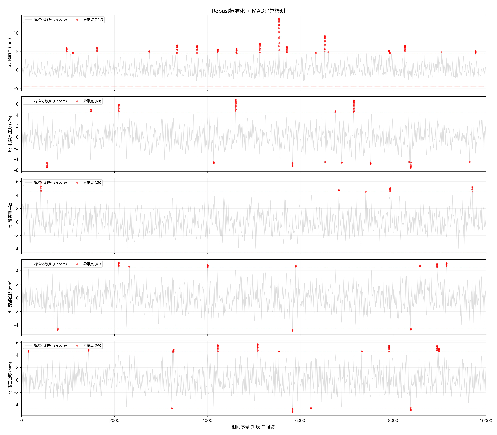

# 异常检测报告：Robust 标准化 + 统一 MAD 准则

## 1. 概述

本报告对应问题 3.2：基于 3.1 预处理后的训练集数据（5 变量 × 10000 时间点），对各变量开展**单变量异常值检测**，并识别**共同异常点**（同一时间点 ≥ 2 个监测变量同时异常）。

整体流程：

1. **Robust 标准化** — 将各变量转换到统一的无量纲尺度
2. **MAD 异常检测** — 在标准化空间用统一阈值 $k = 4.5$ 标记异常
3. **共同异常点筛选** — 取 ≥ 2 个变量同时被标记的时间点
4. **组合类型统计** — 对共同异常点的变量组合进行汇总分析

---

## 2. 方法原理

### 2.1 Robust 标准化

> [!info] 为什么用 Median + MAD 而非均值 + 标准差？
> 均值 $\bar{x}$ 和标准差 $\sigma$ 对异常值极其敏感——一个极端大值就能把均值拉偏、把标准差撑大，导致异常点被"淹没"。而中位数 (Median) 和**中位绝对偏差 (MAD)** 是稳健统计量，不受少量异常点的影响。

对每个变量的原始序列 $\{x_t\}$，定义：

$$
\text{median} = \text{median}(x_t)
$$
$$
\text{MAD} = \text{median}(|x_t - \text{median}|)
$$

标准化后的 z 值为：

$$
z_t = \frac{x_t - \text{median}}{\text{MAD}}
$$

$z_t$ 表示该点偏离中位数的**MAD倍数**，无量纲。经过此变换，5 个量纲各异的变量（降雨量 mm、孔隙水压力 kPa、微震事件数、深部位移 mm、表面位移 mm）统一到同一标尺下，可直接用统一阈值进行比较。

各变量标准化后的统计信息：

| 变量 | 标准化后中位数 | 标准化后 MAD | 最小值 | 最大值 |
|------|:------------:|:----------:|:-----:|:-----:|
| a：降雨量 | 0.000 | 1.000 | -3.4 | 13.9 |
| b：孔隙水压力 | 0.000 | 1.000 | -5.6 | 6.8 |
| c：微震事件数 | 0.000 | 1.000 | -4.1 | 6.1 |
| d：深部位移 | 0.000 | 1.000 | -4.9 | 5.2 |
| e：表面位移 | 0.000 | 1.000 | -5.2 | 5.7 |

可见标准化后各变量的分布中心均为 0，离散度均为 1，统一可比。

### 2.2 MAD 异常检测准则

在标准化空间，异常判定规则为：

$$
|z_t| > k \cdot \text{MAD}(z)
$$

其中 $k = 4.5$ 为检测阈值。由于标准化后 $\text{MAD}(z) \equiv 1$，判据简化为：

$$
|z_t| > 4.5
$$

即：**偏离中位数超过 4.5 倍 MAD 的点判为异常**。

> [!note] 阈值 k = 4.5 的选择依据
> 对于近似正态分布的数据，$|z| > 3$ 的概率约 0.3%，$|z| > 4$ 约 0.006%，$|z| > 4.5$ 约 0.0003%。考虑到监测数据的实际分布存在厚尾特征，选择 $k = 4.5$ 可在**避免漏报**（阈值过高）与**避免误报大量正常波动**（阈值过低）之间取得平衡。实测结果显示总异常占比约 0.64%，处于合理范围。

### 2.3 共同异常点判定

$$
\text{共同异常} \iff \sum_{v \in \{a,b,c,d,e\}} \mathbb{I}(|z_t^{(v)}| > 4.5) \geq 2
$$

即同一时间点至少有 2 个变量同时被标记为异常，才认定为共同异常事件。

---

## 3. 表 3.1：单变量异常点检出结果

| 数据集变量 | 异常点数量 | 占比 |
|-----------|:---------:|:---:|
| a：降雨量 | 117 | 1.17% |
| b：孔隙水压力 | 69 | 0.69% |
| c：微震事件数 | 26 | 0.26% |
| d：深部位移 | 41 | 0.41% |
| e：表面位移 | 66 | 0.66% |
| **总数** | **319** | **0.64%** |

**关键观察：**

- **降雨量 (a)** 异常点最多（117 个，1.17%），其分布非对称性最强（min = -3.4, max = 13.9），说明降雨多为低值（甚至零值），但偶有强降雨脉冲远高于中位数，被大量检出。
- **微震事件数 (c)** 异常最少（26 个，0.26%），说明其分布相对集中，极端值较少。
- **深部位移 (d)** 和 **表面位移 (e)** 异常率分别为 0.41% 和 0.66%，位移量的异常往往是滑坡风险的重要信号。

---

## 4. 表 3.2：共同异常点情形分析

共检出 **32 个共同异常时间点**（≥ 2 变量同时异常），其中前 20 个如下表：

| 时间点编号 | 异常变量组合 | 意义 |
|:---------:|:----------:|------|
| 2088–2094 | **bd**（孔隙水压力 + 深部位移） | 连续 7 个时间点，孔隙水压力与深部位移同时异常，疑似强降雨入渗事件 |
| 4223–4227 | **ae**（降雨量 + 表面位移） | 连续 5 个点，降雨驱动表面位移加速 |
| 5542–5543 | **ae**（降雨量 + 表面位移） | 另一轮降雨-位移同步异常 |
| 5832–5834 | **bde**（孔隙水压力 + 深部位移 + 表面位移） | 三联异常，孔隙水压力升高→深部滑动→地表响应，典型滑坡前兆链 |
| 5835 | **be**（孔隙水压力 + 表面位移） | 三联回退为二联，降雨效应衰减 |
| 7911–7912 | **ae**（降雨量 + 表面位移） | 第三轮降雨-位移同步异常 |

> [!tip] 连续异常的意义
> 共同异常点往往不是孤立出现的，而是**成段连续**出现（如 2088–2094 连续 7 个点、4223–4227 连续 5 个点）。这说明异常并非随机噪声，而可能是某种持续性外部扰动（如降雨过程或工程爆破）触发了多变量的连锁响应。

---

## 5. 共同异常点组合类型统计

| 组合类型 | 涉及变量 | 出现次数 | 占比 |
|:-------:|---------|:-------:|:---:|
| **ae** | 降雨量 + 表面位移 | 11 | 34.38% |
| **bd** | 孔隙水压力 + 深部位移 | 7 | 21.88% |
| **bde** | 孔隙水压力 + 深部位移 + 表面位移 | 6 | 18.75% |
| **de** | 深部位移 + 表面位移 | 6 | 18.75% |
| **be** | 孔隙水压力 + 表面位移 | 2 | 6.25% |

**按同时异常变量数量分组：**

| 同时异常变量数 | 时间点数量 | 占比 |
|:-------------:|:---------:|:---:|
| 2 个变量 | 26 | 81.25% |
| 3 个变量 | 6 | 18.75% |

**结论：**

1. **ae（降雨量 + 表面位移）是占比最高的组合**（34.38%），说明降雨是诱发表面位移异常的最主要外部因素，二者具有强耦合性。
2. **bd（孔隙水压力 + 深部位移）占 21.88%**，反映降雨入渗导致孔隙水压力升高、深部滑动的物理过程。
3. **bde 三联异常占 18.75%**——孔隙水压力↑ → 深部位移↑ → 表面位移↑，构成了完整的"降雨入渗-深部滑动-地表响应"因果链，是滑坡预警的关键前兆模式。
4. 81.25% 的共同异常仅涉及 2 个变量，18.75% 涉及 3 个变量，**未出现 4 或 5 个变量同时异常的情况**，说明变量之间存在特定的耦合关系而非全局同步异常。

---

## 6. 可视化

图中展示了 5 个变量在标准化空间的时间序列（灰色），红色散点标记了异常点（$|z| > 4.5$），红色虚线为 $\pm k$ 阈值线。各变量统一标尺，便于跨变量对比异常分布模式。

---

## 7. 异常检测合理性讨论

> [!info] 区分噪声异常与物理异常
> 并非所有统计上的 "异常点" 都是传感器故障或噪声——许多异常具有明确的物理含义：
>
> - **孤立异常**（单点超出阈值，但前后点正常）→ 可能是传感器尖峰噪声或数据跳变
> - **连续异常**（多点连续超出阈值）→ 往往对应真实的物理事件（如降雨过程、爆破扰动）
> - **多变量同步异常** → 最可信的物理信号，因为不同传感器的独立噪声几乎不可能在时间上精确对齐

本文采用的策略是：
- 保留所有统计异常供后续分析（表 3.1），但通过**多变量共同异常**筛选（表 3.2）自动过滤掉单个变量上的孤立噪声，聚焦于有物理意义的联动异常。
- 连续异常段（如 2088–2094、4223–4227）可追溯到时序中的特定事件，进一步验证其真实性。

这一"宽进严出"的二阶段策略（单变量检出 → 多变量共识）有效兼顾了**检测灵敏度**与**结果可信度**。
