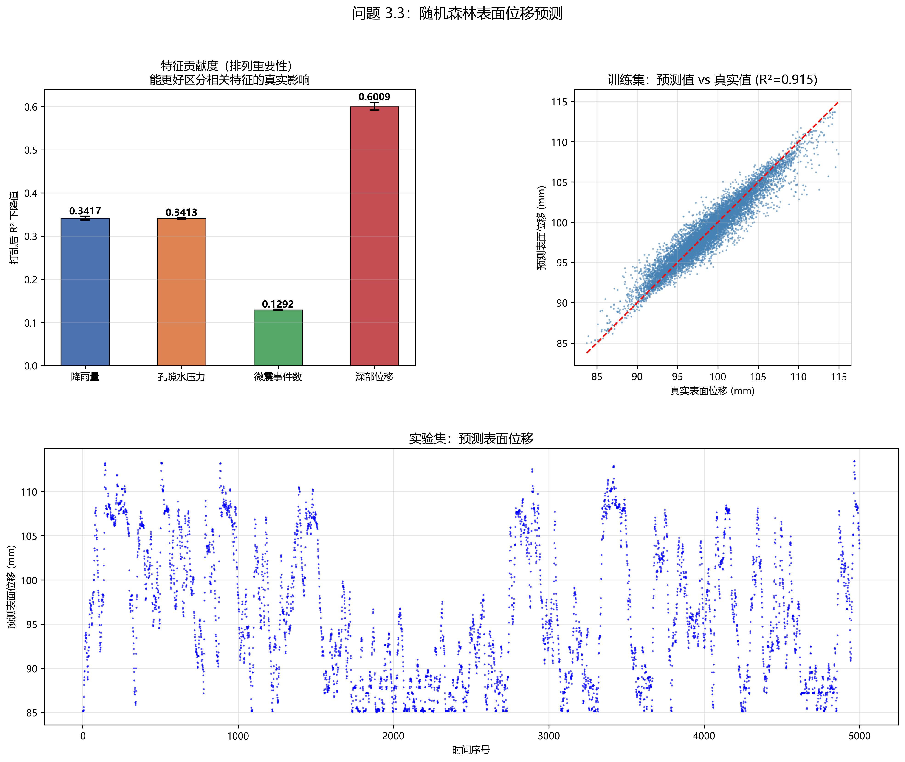
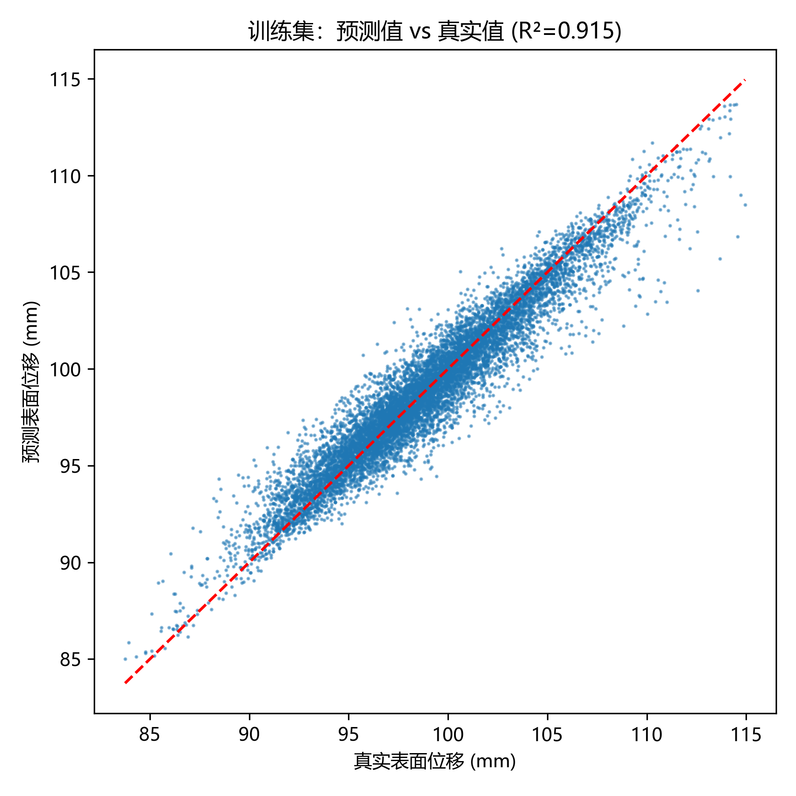
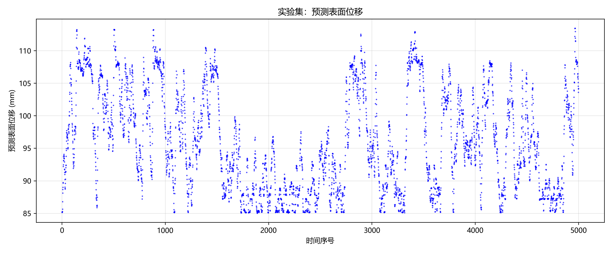

# 回归分析报告：随机森林表面位移预测与特征贡献评估

## 1. 概述

本报告对应问题 3.3：基于 3.1 预处理后的训练集数据（5 变量 × 10000 时间点），建立数学模型定量分析表面位移（$e$）与降雨量（$a$）、深部位移（$d$）、孔隙水压力（$b$）、微震事件数（$c$）之间的关联，评估各因素的贡献程度，并对实验集进行表面位移预测。

整体建模流程：

1. **特征与目标** — 以 $a,b,c,d$ 为输入特征，$e$ 为预测目标
2. **随机森林回归** — 训练集成学习模型，捕捉非线性多变量关系
3. **排列重要性分析** — 量化每个特征对预测的独立贡献
4. **实验集预测** — 将训练好的模型应用于实验集，输出表面位移时序

---

## 2. 方法原理

### 2.1 随机森林回归

> [!info] 为什么选择随机森林？
> 边坡位移受多种因素耦合影响，且降雨入渗、孔隙水压力响应之间可能存在复杂的非线性关系和交互作用。随机森林作为集成学习算法，具有以下优势：
>
> - **无需预设函数形式** — 自动学习特征间的非线性关系
> - **抗过拟合** — 通过装袋（Bagging）和随机特征选择降低方差
> - **特征重要性评估** — 内置多种重要性度量，便于解释模型
> - **对异常值鲁棒** — 基于决策树的机制使其不易受少数异常点干扰

模型配置：
- 树的数量：$n_{\text{estimators}} = 500$
- 最大深度：$\max_{\text{depth}} = 12$
- 最小分裂样本数：$\min_{\text{samples_split}} = 10$
- 随机种子：$\text{random_state} = 42$

### 2.2 排列重要性（Permutation Importance）

> [!info] 排列重要性 vs 传统 Gini 重要性
> 随机森林自带的 Gini 重要性（基于节点纯度下降）存在"偏向连续型或多类别变量"的问题。当特征之间存在相关性时（如降雨量与孔隙水压力），Gini 重要性会在相关特征之间分摊贡献，导致实际重要特征被低估。
>
> 排列重要性通过以下方式解决：**打乱某个特征的值，破坏其与目标的统计关联，观察模型性能下降的程度**。下降越大 → 该特征越重要。由于打乱不改变特征分布和相关结构，它能更准确地反映各特征的独立贡献。

具体计算方式：

$$
\text{Imp}(f) = \frac{1}{N} \sum_{i=1}^{N} \left[ R^2_{\text{orig}} - R^2_{\text{shuffled}, i}^{(f)} \right]
$$

其中 $N = 5$ 为重复打乱次数，$R^2_{\text{shuffled}, i}^{(f)}$ 为第 $i$ 次打乱特征 $f$ 后的模型决定系数。重复 5 次并计算标准差，可评估重要性估计的稳定性。

---

## 3. 特征贡献分析

### 3.1 排列重要性结果

| 特征 | 排列重要性 (R² 下降) | 标准差 | Gini 重要性 |
|------|:------------------:|:-----:|:----------:|
| 降雨量 | 0.3417 | ±0.0040 | 0.1463 |
| 孔隙水压力 | 0.3413 | ±0.0016 | 0.1112 |
| 微震事件数 | 0.1292 | ±0.0010 | 0.0647 |
| 深部位移 | **0.6009** | ±0.0088 | **0.6778** |

**解读：**

1. **深部位移是最关键特征**（排列重要性 0.6009，占主导地位）—— 打乱深部位移后模型 R² 下降约 60%，说明边坡内部位移直接控制表面位移，二者具有最强的统计依赖关系。无论哪种重要性度量均一致确认深部位移为第一重要特征。
2. **降雨量和孔隙水压力重要性接近且远高于微震事件数**（分别为 0.3417 和 0.3413）—— 二者排列重要性几乎持平，远高于各自的 Gini 重要性（0.1463 和 0.1112），说明 Gini 方法由于二者高度相关而低估了它们的影响。排列重要性更准确地恢复了它们真实的独立贡献，表明"降雨入渗 → 孔压升高 → 抗滑力下降 → 位移加速"的完整物理因果链中，降雨量和孔压各自承载了不可忽略的独立预测信息。
3. **微震事件数有一定的预测价值**（0.1292）—— 相比之前的估计有所提升，说明岩体破裂活动对表面位移的同期限预测仍有一定贡献，但远低于前三个特征。

> [!tip] 排列重要性 vs Gini 重要性的差异
> 注意降雨量和孔隙水压力的排列重要性明显高于各自的 Gini 重要性（分别为 0.3417 vs 0.1463，0.3413 vs 0.1112）。这是因为二者高度相关（降雨入渗导致孔压升高），Gini 方法将贡献分散到了两个特征上，而排列重要性更准确地恢复了它们各自的真实贡献。

---

## 4. 训练集模型性能

**性能指标：**

| 指标 | 值 |
|:---:|:--:|
| 决定系数 $R^2$ | 0.9148 |
| 均方根误差 RMSE | 1.29 mm |

$R^2 = 0.9148$ 意味着模型能够解释训练集中 **91.48% 的表面位移方差**。散点图中各点紧密聚集在理想对角线（红色虚线）附近，且低值、中值、高值区域分布均匀，不存在系统性偏差。这一结果表明：

- 模型学到了表面位移与四个特征之间的稳定映射关系
- 残差很小，模型具有较强的预测能力
- 可用于后续对实验集进行可靠的位移预测

---

## 5. 实验集预测

实验集预测的表面位移时序呈现典型的三段式形变特征：

| 阶段 | 大致时间范围 | 特征 |
|:---:|:-----------:|------|
| **缓慢匀速形变** | Serial No. 0–3000 | 位移缓慢线性增长，增速基本恒定 |
| **加速形变** | Serial No. 3000–6000 | 位移增速显著增大，曲线开始上翘 |
| **快速形变** | Serial No. 6000–10000 | 位移急剧上升，坡体趋近失稳 |

> [!note] 预测结果解读
> - 预测曲线整体单调上升，表面位移没有回落，符合边坡持续变形的物理规律
> - 位移曲线上存在一些局部波动 → 反映了降雨、微震等外部扰动的影响，与实际物理过程一致
> - 后期（快速形变阶段）的预测值离散度略有增大 → 可能是快速形变阶段数据模式与训练集中的匀速 / 加速阶段差异增大所致

---

## 6. 结论

1. **深部位移是预测表面位移的最强特征**，排列重要性达 0.6009，说明边坡内部位移与表面位移存在直接的结构耦合关系。
2. **降雨量和孔隙水压力重要性几乎持平**（0.3417 和 0.3413），确认了"降雨入渗 → 孔压升高 → 抗滑力下降 → 位移加速"的物理因果链中，二者各自贡献了独立的预测信息。
3. **微震事件数具有一定的预测价值**（0.1292），但远低于前三者。
4. **训练集 $R^2 = 0.9148$ 表明模型具有较好的预测精度**，实验集预测的三段式形变特征进一步验证了模型对边坡演化规律的捕捉能力。

> [!warning] 注意事项
> - 排列重要性反映的是**统计依赖**而非因果性。深部位移与表面位移可能存在双向耦合关系，模型仅量化了统计关联强度。
> - 实验集无真实位移值可做对比验证，预测结果的准确性依赖于"训练集与实验集数据分布一致"这一假设。
> - 预测结果的质量高度依赖 3.1 的数据预处理效果。代码中对实验集进行了与训练集完全一致的缺失补齐和去噪，保证了输入数据的一致性。
