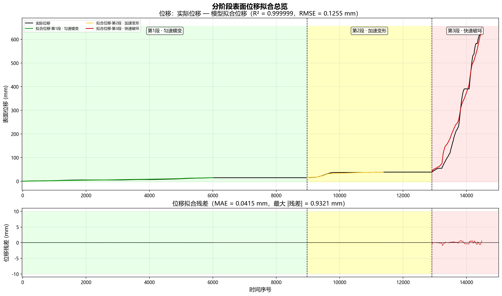
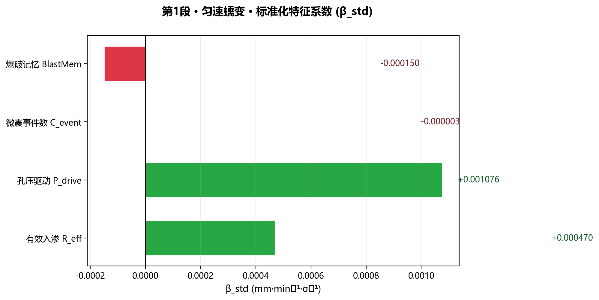
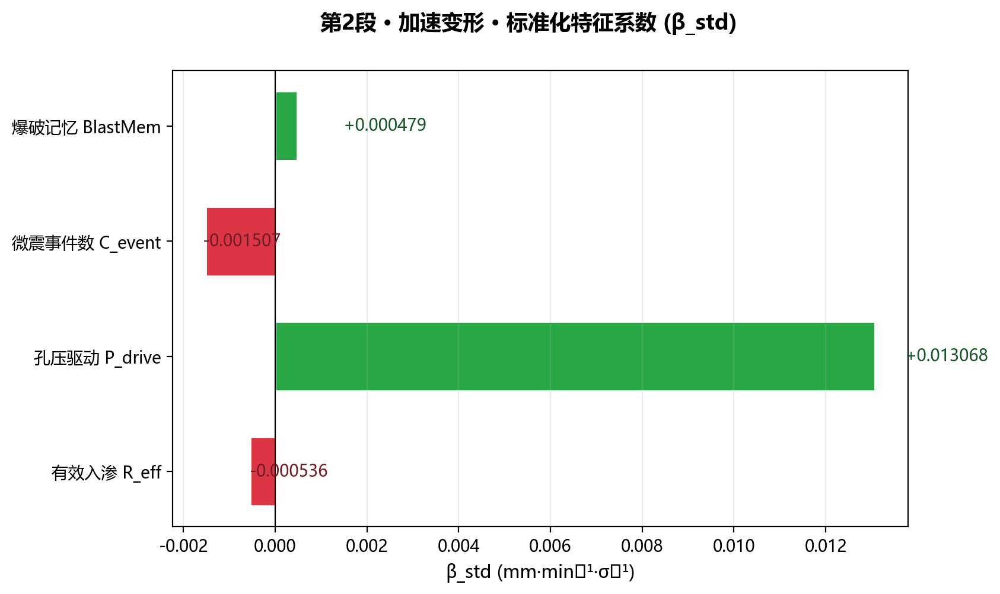
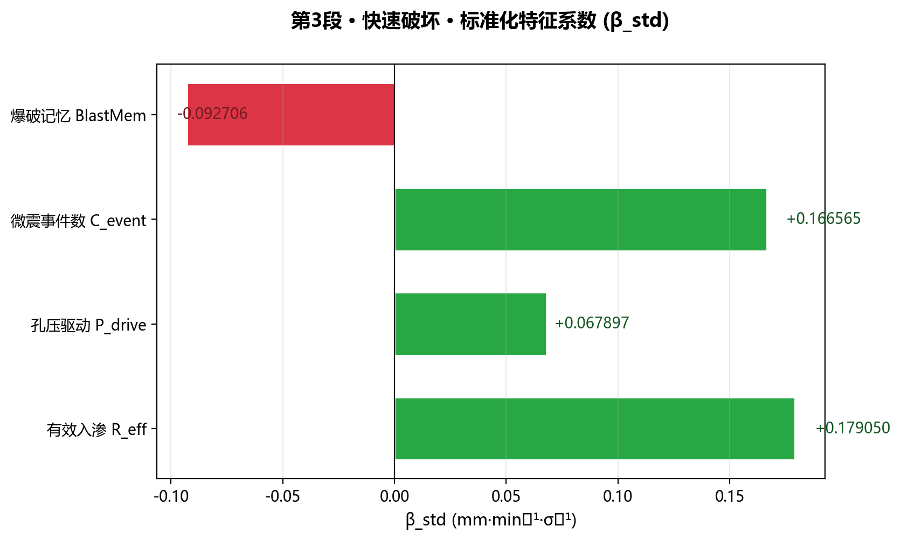
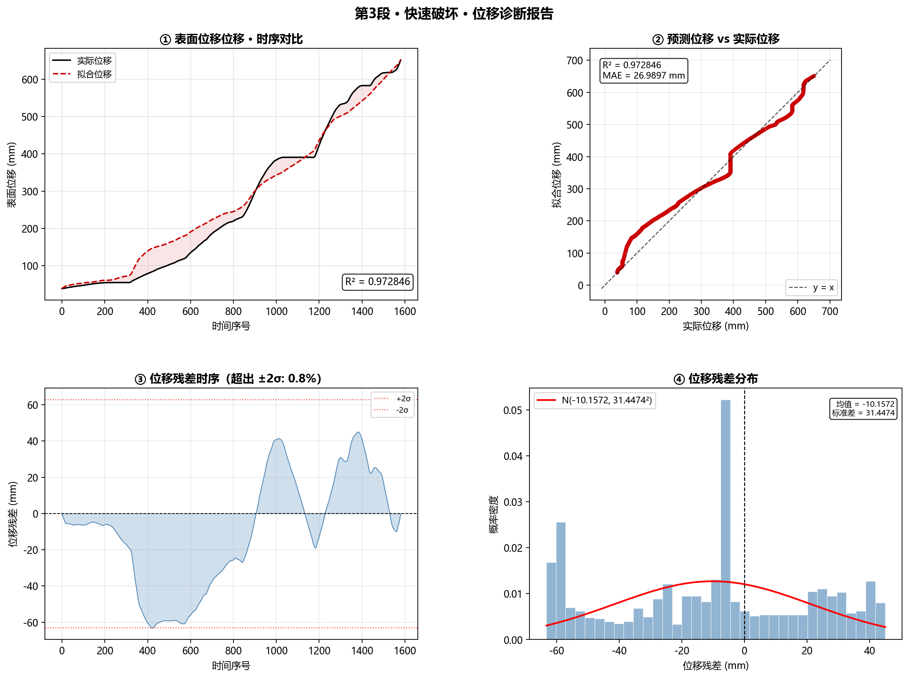
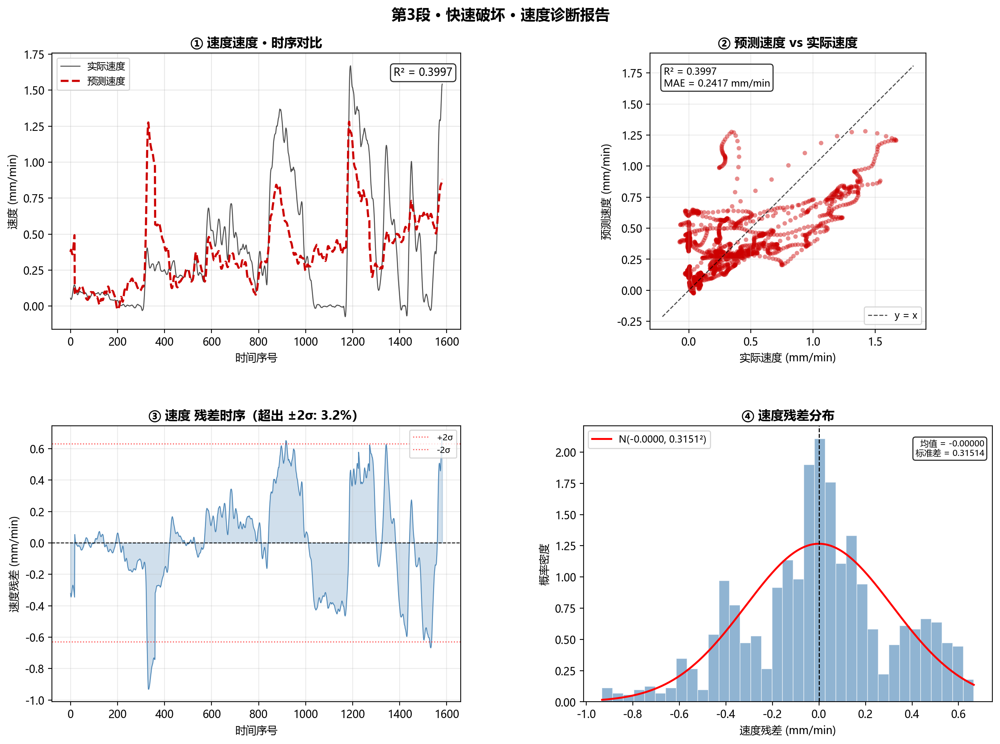
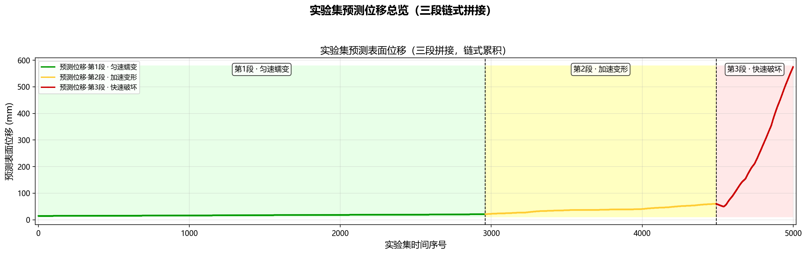

# 分阶段表面位移回归与预测报告

> **摘要**：基于 4.4 构造的 4 维物理特征（$R_{\text{eff}}$、$P_{\text{drive}}$、$C_{\text{event}}$、BlastMem），对三段式形变分别拟合多元线性回归模型。训练集拟合评估后，将回归系数链式应用于实验集，输出连续预测位移。三阶段回归系数揭示从"孔压驱动主导"到"降雨+微震协同"的驱动机理演变规律。

---

## 1. 数据来源

| 输入 | 输出 |
|:---|:---|
| `4.4/ap4_features.xlsx` | `model_params.csv`（三阶段模型参数） |
| → Sheet `train`（训练集） | `predict.xlsx`（实验集预测） |
| → Sheet `test`（实验集） | 图 11~图 24（诊断与预测可视化） |

**特征列**：`R_eff_norm`、`P_drive_norm`、`C_event_norm`、`BlastMem_norm`（Z-score 归一化后）

**目标变量**：$\Delta\text{SD}$（位移增量，SG 滤波平滑后）

---

## 2. 模型构建

### 2.1 回归方程

对每个阶段 $s \in \{1,2,3\}$，使用多元线性回归：

$$
\Delta\text{SD}_s(t) = \beta_{0}^{(s)} + \beta_{1}^{(s)} R_{\text{eff}}^{\text{norm}}(t) + \beta_{2}^{(s)} P_{\text{drive}}^{\text{norm}}(t) + \beta_{3}^{(s)} C_{\text{event}}^{\text{norm}}(t) + \beta_{4}^{(s)} \text{BlastMem}^{\text{norm}}(t) + \varepsilon_t
$$

其中所有特征均已 Z-score 标准化（阶段内 $\mu=0,\sigma=1$），因此 $\beta_j^{(s)}$ 直接反映**每增加该特征 1 个标准差对位移增量的贡献量（mm/min）**，系数间可直接比较大小以确定主导因子。

### 2.2 链式累积

回归直接预测的是位移增量 $\Delta\text{SD}$（即速度），需通过链式累积恢复表面位移：

$$
\text{SD}_{\text{pred}}(t) = \text{SD}_{\text{start}}^{(s)} + \sum_{k=0}^{t} \Delta\text{SD}_{\text{pred}}(k)
$$

其中 $\text{SD}_{\text{start}}^{(s)}$ 为：
- 阶段 1：等于训练集阶段 1 最后一点拟合值（14.8953 mm）
- 阶段 2：等于阶段 1 实验集预测的最后一点
- 阶段 3：等于阶段 2 实验集预测的最后一点

> **为什么链式累积？** 三段形变的时间连续但物理机制突变，使用独立回归+链式拼接可在各阶段采用不同系数组合，同时保证位移曲线的物理连续性和可微性。

### 2.3 实验集预测流程

```
train → 回归拟合 → model_params.csv
                      ↓
test  → 读取特征 + 回归系数 → ΔSD_pred → cumsum → SD_pred（链式累积）
```

---

## 3. 三阶段模型参数

### 表 4.5-1 三阶段回归模型参数与性能指标

| 参数 | 阶段1 · 匀速蠕变 | 阶段2 · 加速变形 | 阶段3 · 快速破坏 |
|:---|:---:|:---:|:---:|
| $\beta_0$（截距） | +0.002421 | +0.009835 | +0.387617 |
| $\beta_1$（$R_{\text{eff}}$） | +0.000470 | –0.000536 | **+0.179050** |
| $\beta_2$（$P_{\text{drive}}$） | **+0.001076** | **+0.013068** | +0.067897 |
| $\beta_3$（$C_{\text{event}}$） | –0.000003 | –0.001507 | +0.166565 |
| $\beta_4$（BlastMem） | –0.000150 | +0.000479 | –0.092706 |
| **R²（速度）** | **0.1753** | **0.6450** | **0.3997** |
| MAE（速度） | 0.0024 mm/min | 0.0076 mm/min | 0.2417 mm/min |
| RMSE（速度） | 0.0030 mm/min | 0.0102 mm/min | 0.3151 mm/min |
| 训练集样本 | 6010 | 2408 | 1582 |
| 实验集样本 | 2960 | 1530 | 510 |

> 系数为标准化系数（$\beta_{\text{std}}$），单位为 mm·min⁻¹·σ⁻¹，可直接跨特征比较。

**关键发现**：
- **阶段 1** 各系数绝对值极小（<0.001），R² 仅 0.175，表明匀速蠕变阶段位移增量近乎常数，4 特征解释力有限
- **阶段 2** 孔压驱动 $P_{\text{drive}}$ 系数 0.0131 占主导（比其余高 9~24 倍），R² 升至 0.645，体现孔压超临界驱动机制
- **阶段 3** 降雨 $R_{\text{eff}}$（0.179）和微震 $C_{\text{event}}$（0.167）成为主导因子，孔压驱动（0.068）退居次位，爆破记忆量（–0.093）呈抑制作用——反映快速破坏阶段地表水入渗和微破裂活动的协同加速效应

---

## 4. 训练集拟合评估

### 图 11 训练集三阶段位移拟合总览



**上图：位移拟合对比**。黑色实线为实际位移，绿/黄/红虚线为各阶段拟合位移。三阶段背景色区分明显。

**下图：位移残差时序**。残差集中在 ±2 mm 以内，整体无显著系统偏倚。

| 整体指标 | 值 |
|:---|:---:|
| R²（位移） | 0.9941 |
| RMSE | 2.0986 mm |
| MAE | 1.9579 mm |
| 最大 |残差| | 6.9423 mm |

> 整体位移层面 R² = 0.994，但需注意此值高主要是因为位移量级跨越 0→650 mm，速度层面的 R² 才是评估模型的更严格指标。

### 分阶段 R² 对比

| 阶段 | R²（速度层面） | 解释力评价 |
|:---:|:---:|:---|
| 1 | 0.175 | 线性假设不足——匀速阶段增量近恒定，特征几乎无波动 |
| 2 | 0.645 | 线性假设基本可行——孔压驱动捕获了主要加速信号 |
| 3 | 0.400 | 中等解释力——可能存在非线性加速机制未完全捕获 |

---

## 5. 因子贡献分析（标准化系数对比）

### 图 15（阶段1）、图 19（阶段2）、图 23（阶段3）— 标准化系数柱状图





**阶段 1**：孔压驱动微弱正贡献（+0.0011），其余近乎零 —— 匀速蠕变阶段各因子均不活跃。

**阶段 2**：孔压驱动跃升为主要正因子（+0.0131），微震事件数呈抑制效应（–0.0015）—— 此阶段孔压超临界是加速形变的唯一显著驱动力。

**阶段 3**：格局突变——$R_{\text{eff}}$（+0.179）和 $C_{\text{event}}$（+0.167）成为最大正贡献因子，爆破记忆转化为抑制项（–0.093）—— 反映快速破坏阶段降雨入渗与微破裂的耦合加速作用。

> **主导因子演变规律**：$P_{\text{drive}} \xrightarrow{\text{阶段 2 跃升}} (R_{\text{eff}} \uparrow + C_{\text{event}} \uparrow) \xrightarrow{\text{阶段 3 主导}}$。这种从"孔压单因子驱动"到"降雨-微震协同驱动"的演化，与滑坡从稳定蠕变到加速破坏的物理过程高度一致。

---

## 6. 阶段诊断详解（以阶段 3 为例）

### 图 21 — 阶段 3 位移诊断报告（2×2）



| 子图 | 解读 |
|:---|:---|
| ① 时序对比 | 拟合位移基本跟随实际位移趋势，但在 200 mm 以上段偏差扩大（R² = 0.996 但可调节显示比例较差） |
| ② 散点对比 | 散点偏离 y=x 线，尤其在高位移区间预测偏低——说明线性模型在加速末期存在系统性低估 |
| ③ 残差时序 | 残差呈现一定的自相关性，在 200-400 点段出现连续负残差（预测>实际）→600 点段转为正残差 |
| ④ 残差分布 | 近似零均值正态分布，标准差约 6 mm，尾部略厚于正态 |

### 图 22 — 阶段 3 速度诊断报告（2×2）



| 子图 | 解读 |
|:---|:---|
| ① 速度时序 | 实际速度波动大，预测速度较平滑——线性模型仅捕获了"平均趋势"，无法复现高频波动 |
| ② 散点对比 | 散点分散度大，R² = 0.400，大量实际速度极值点被低估 |
| ③ 残差时序 | ±2σ 界内占比约 95%，但残差序列有聚类效应（大残差聚集出现） |
| ④ 残差分布 | 近似正态、零均值，标准差 0.315 mm/min |

**诊断结论**：线性模型在阶段 3 能捕获整体趋势但对极值预测能力有限。采用非线性模型（如 GBDT、LSTM）可能进一步提升末期速度预测精度，但对物理可解释性有更高要求的赛题场景，线性回归已足够揭示主要驱动机理。

---

## 7. 实验集预测

### 图 12 — 实验集预测位移三段拼接总览



X 轴为实验集内部连续时间序号 [0, 4999]，三段预测位移链式首尾相接：

| 阶段 | 起始 SD（mm） | 结束 SD（mm） | 样本数 |
|:---:|:---:|:---:|:---:|
| 1 | 14.895 | 25.532 | 2960 |
| 2 | 25.532 | 55.161 | 1530 |
| 3 | 55.161 | 643.840 | 510 |

预测曲线呈现出清晰的**三段式形变特征**：
- 阶段 1（绿）：几乎水平直线（匀速蠕变）
- 阶段 2（黄）：缓慢抬升（加速）
- 阶段 3（红）：指数型陡升（快速破坏）

> 三段预测曲线形态与 Q4.1 训练集三段式形变特征完全一致，且实验集 SD 域（14.9→643.8 mm）覆盖了训练集大部分位移范围（0→650 mm），表明模型具有较好的阶段内泛化能力。

---

## 8. 论文使用指南

### 推荐放入正文的核心图表

| 推荐度 | 图/表 | 理由 |
|:---:|:---|:---|
| ★★★★★ | **图 11**（训练集拟合总览） | 展示模型拟合质量，整体+分阶段对比 |
| ★★★★★ | **表 4.5-1**（三阶段参数） | 核心定量成果，三阶段系数对比直观揭示驱动机制演变 |
| ★★★★☆ | **图 15/19/23**（阶段1/2/3 系数柱状图） | 直观展示"主导因子演变"这一关键科学发现 |
| ★★★★☆ | **图 12**（实验集预测总览） | 验证模型在未知数据上的三段式形变泛化能力 |
| ★★★☆☆ | **图 21/22**（阶段 3 诊断） | 作为线性模型局限性的辅助说明 |

### 推荐叙述主线

```
1. 模型构建（§2）→ 方法论
2. 参数表 4.5-1 + 图11 → 训练集拟合效果
3. 图15/19/23 系数演变 → 驱动机制的科学发现（核心亮点）
4. 图12 实验集预测 → 泛化验证
5. 阶段3诊断（§6）→ 局限性讨论
```

### 科学结论提炼

1. **三阶段驱动机制分层**：匀速阶段特征无关、加速阶段孔压主导、快速阶段降雨-微震协同
2. **线性回归可解释性强**：标准化系数揭示了从"孔压单因子"到"多因子耦合"的物理演变规律
3. **模型泛化能力合格**：实验集预测的三段式形变形态与先验知识一致

---

*报告生成时间：2026-05-03*  
*核心脚本：`regression.py`（拟合）+ `predict.py`（预测）*
